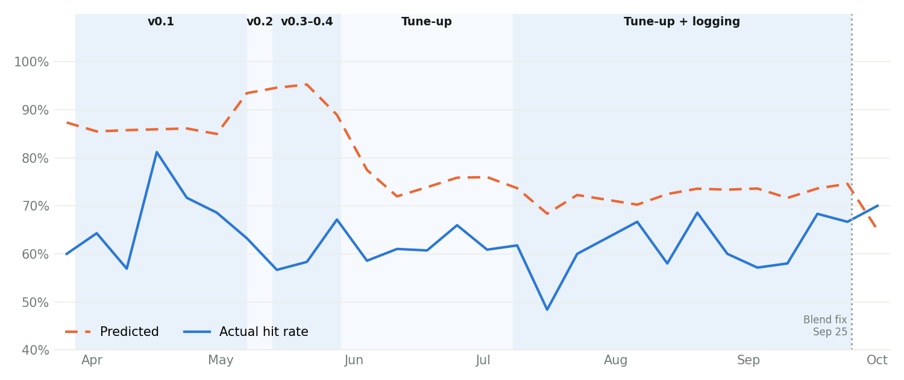
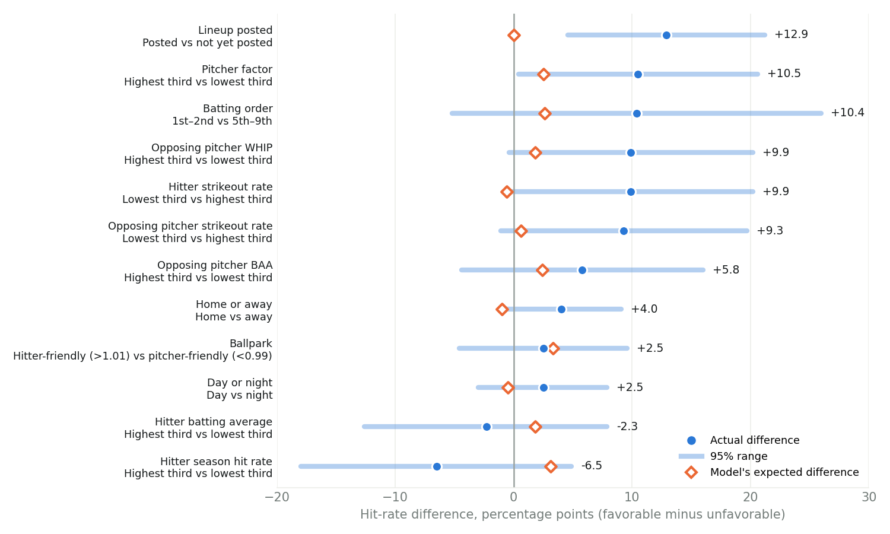
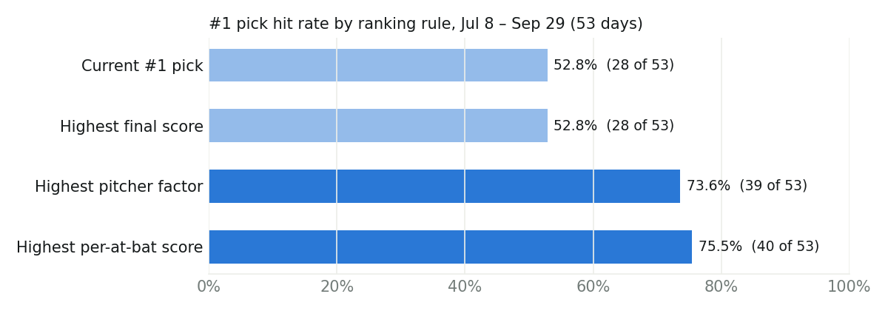

# BTS 2026 Factor Breakdown

How the BTS pick model changed over the 2026 season, and which of its inputs actually moved the hit rate. It looks past the overall hit rate to why the picks performed the way they did.

**Data:** 1,406 scored picks (the daily top 10) from Mar 28 to Sep 29, 2026. Model inputs were saved to `prediction_features` starting Jul 8, so the matchup and lineup sections use the 515 picks from Jul 8 to Sep 29 (53 game days). Ballpark, home/away and day/night use all 1,406.

## Summary

- **Pitcher quality, strikeouts and lineups moved the hit rate most.** Each was worth about 9–13 percentage points between favorable and unfavorable groups. The model's final score expected 0–3 points for the same groups.
- **The signal is in the model, then the final score dilutes it.** Sorting each day's list by the per-at-bat score would have made the #1 pick hit 75.5% of days instead of 52.8%. The season hit-rate blend is the main reason.
- **Ballpark and home/away are small effects,** a few points each and inside the margin of error.
- **The model went through five versions.** Predictions ranged from 73% to 98% across them, but the actual hit rate stayed between 61% and 70%, and no version sorted hitters better than chance.
- **Several inputs never worked:** pitcher handedness, recent form, and a few park and player lookups. They are listed at the end.

## How the model changed through the season

| Version | Picks scored | Picks | Predicted | Actual | Gap | #1 pick | Hit ranked above miss |
| --- | --- | --- | --- | --- | --- | --- | --- |
| v0.1 | Mar 28 – May 6 | 368 | 85.8% | 66.3% | −19.5 pts | 27 of 39 | 47% |
| v0.2 | May 7 – May 12 | 60 | 98.2% | 70.0% | −28.2 pts | 4 of 6 | 47% |
| v0.3–0.4 | May 13 – May 28 | 140 | 94.4% | 60.7% | −33.7 pts | 8 of 14 | 48% |
| Tune-up | May 29 – Jul 7 | 323 | 75.6% | 63.2% | −12.5 pts | 25 of 32 | 52% |
| Tune-up, inputs logged | Jul 8 – Sep 24 | 505 | 72.7% | 60.8% | −11.9 pts | 27 of 52 | 52% |

*Hit ranked above miss* is how often a pick that got a hit had a higher score than a pick that didn't (the AUC). 50% means the scores didn't sort hitters at all. Version boundaries come from the project's commit history, matched to the dates the predictions changed. Some changes appear in the picks a day or two before their commit date. The Sep 25 fix has only one day of results so far (10 picks) and is not in the table.

### What changed in each version

Only changes to how picks are scored are listed.

**v0.1 (Mar 28 – May 6): the heuristic.** Last season's batting average × opposing pitcher WHIP × platoon bonus × contact bonus (strikeout rate), converted to a chance of at least one hit over the expected plate appearances for the batting-order spot. Park factors were added the evening of Mar 28.
- Apr 5: confirmed lineups are scored first; teams without a posted lineup are scored from a projected pool at the 5th spot.
- Apr 10: projected pools are limited to the active roster.
- Apr 12: at most 3 picks per opposing pitcher, and a small penalty for hitters with fewer plate appearances.
- May 2: doubleheaders are scored as two chances.

**v0.2 (committed May 8, picks from May 7): pitcher BAA and the season hit-rate blend.** The pitcher factor became 65% BAA, 35% WHIP. The contact bonus got steeper, same-side matchups got a 3% penalty, and the scoring code stopped assuming unknown hitters are switch hitters. The final score started blending in the hitter's season hit rate at 15–50% weight. That hit rate was calculated as hits per game, which can exceed 1.0, and it pushed 14 picks above 100% on May 7–12.

**v0.3–0.4 (committed May 16–17, picks from May 13): cap added, blend turned up.** Hits per game was capped at 1.0. The pitcher factor got an exponent and a pitcher strikeout adjustment, then was reweighted to 80% BAA, 20% WHIP. The blend weight rose to 40–70%. The per-pitcher limit went to 2, then back to 3 with 3% and 5% penalties. Most regulars average at least a hit per game, so most picks got the same capped 1.0 for 40–70% of their score, which produced the tight band near 94%.

**Tune-up (committed May 31, picks from May 29): the formula still in use.** The hit rate became games with a hit ÷ games played, capped at 92%, at 30–60% weight. The pitcher factor became BAA only, measured against a league baseline, so WHIP left the pitcher factor. Added a team pitching-staff factor, a recent-form bonus, and a conversion over expected at-bats instead of plate appearances. The per-at-bat cap rose to .450. On Jul 3 the league baselines were updated (.245 → .249 BA, .280 → .282 BAA).

**Logging (running from Jul 8, committed Jul 18).** Each pick's inputs started going to `prediction_features`. The scoring didn't change.

**Fix (Sep 25).** The nightly stats load had been overwriting stored hit rates with blanks when the source didn't provide them. Before the fix, 20% of logged picks had no hit rate and skipped the blend.

`apply_first_base_leverage()`, a first-baseman defense adjustment, has been in `recommend.py` since Apr 5 but is never called.

### What the version history means for the findings

1. **The matchup findings test the current formula.** Scoring hasn't changed since the May 31 tune-up apart from the Jul 3 baseline update, so the Jul 8 – Sep 24 picks describe the model as it runs today.
2. **WHIP left the pitcher factor, but it still predicted hits.** Opposing WHIP separated picks by about 10 points, more than BAA (about 6). It is worth testing again.
3. **The hit-rate blend caused both early problems, and the Sep 25 fix applies it to more picks.** In the current version, hitters with the highest season hit rate did slightly worse. The fix should be checked before it is trusted.
4. **The versions changed confidence, not results.** The May 31 tune-up closed the gap between predicted and actual from about 34 points to about 12.
5. **Full-season charts mix versions.** Every version used the same park table, so ballpark hit rates compare fairly across the season, but predicted values blend formulas. Coors Field picks were predicted at 88.2% before May 29 and 78.6% after, and hit 68.6% and 65.2%.

## What made the most difference

For each factor, the hit rate of the favorable group minus the unfavorable group. Thirds are equal-count splits of the 515 logged picks.

| Factor | Favorable vs unfavorable | Picks used | Picks | Hit rates | Actual diff (pts) | 95% range | Model expected (pts) |
| --- | --- | --- | --- | --- | --- | --- | --- |
| Lineup posted | Posted vs not yet posted | Jul–Sep | 237 / 278 | 67.9% / 55.0% | +12.9 | +4.6 to +21.2 | -0.0 |
| Pitcher factor | Highest third vs lowest third | Jul–Sep | 172 / 172 | 69.2% / 58.7% | +10.5 | +0.4 to +20.6 | +2.5 |
| Batting order | 1st–2nd vs 5th–9th | Jul–Sep, lineup posted | 113 / 53 | 70.8% / 60.4% | +10.4 | -5.2 to +26.0 | +2.6 |
| Opposing pitcher WHIP | Highest third vs lowest third | Jul–Sep | 172 / 172 | 65.7% / 55.8% | +9.9 | -0.4 to +20.2 | +1.8 |
| Hitter strikeout rate | Lowest third vs highest third | Jul–Sep | 172 / 172 | 64.5% / 54.7% | +9.9 | -0.4 to +20.2 | -0.6 |
| Opposing pitcher strikeout rate | Lowest third vs highest third | Jul–Sep | 172 / 172 | 63.4% / 54.1% | +9.3 | -1.1 to +19.7 | +0.6 |
| Opposing pitcher BAA | Highest third vs lowest third | Jul–Sep | 172 / 172 | 65.7% / 59.9% | +5.8 | -4.4 to +16.0 | +2.4 |
| Home or away | Home vs away | Full season | 732 / 674 | 65.2% / 61.1% | +4.0 | -1.0 to +9.1 | -1.0 |
| Ballpark | Hitter-friendly (>1.01) vs pitcher-friendly (<0.99) | Full season | 358 / 342 | 65.9% / 63.5% | +2.5 | -4.6 to +9.6 | +3.3 |
| Day or night | Day vs night | Full season | 425 / 981 | 64.9% / 62.5% | +2.5 | -3.0 to +7.9 | -0.5 |
| Hitter batting average | Highest third vs lowest third | Jul–Sep | 172 / 172 | 60.5% / 62.8% | -2.3 | -12.6 to +7.9 | +1.8 |
| Hitter season hit rate | Highest third vs lowest third | Jul–Sep | 138 / 138 | 58.0% / 64.5% | -6.5 | -18.0 to +4.9 | +3.1 |

## The signal is in the model, then it gets diluted

The model first scores each hitter per at-bat (batting average × pitcher × platoon × contact × park × team), then converts that to a chance of at least one hit and blends in the season hit rate at 30–60% weight. The per-at-bat score separates hitters; the final score doesn't.

| #1 pick chosen by | Days with a hit | Hit rate |
| --- | --- | --- |
| Current #1 pick | 28 of 53 | 52.8% |
| Highest final score | 28 of 53 | 52.8% |
| Highest pitcher factor | 39 of 53 | 73.6% |
| Highest per-at-bat score | 40 of 53 | 75.5% |

Top 3 each day: 61.0% as ranked, 66.0% by per-at-bat score (159 picks each).

Treat the 75.5% as a lead, not a result. It comes from 53 days, the rule was chosen after comparing four options, and its 95% range is roughly 62–85%. A full-season backtest after the data fixes below would confirm it.

## Batter vs. pitcher matchups

Actual hit rate by third of each input, with the value range in parentheses.

| Input | Lowest third | Middle third | Highest third |
| --- | --- | --- | --- |
| Opposing pitcher strikeout rate | 63.4% (12%–19%) | 65.5% (19%–22%) | 54.1% (22%–37%) |
| Hitter strikeout rate | 64.5% (4%–16%) | 63.7% (17%–22%) | 54.6% (22%–34%) |
| Opposing pitcher WHIP | 55.8% (0.80–1.29) | 61.4% (1.30–1.38) | 65.7% (1.38–2.04) |
| Opposing pitcher BAA | 59.9% (.155–.276) | 57.3% (.276–.308) | 65.7% (.308–.400) |
| Hitter batting average | 62.8% (.228–.278) | 59.7% (.278–.309) | 60.5% (.309–.400) |
| Per-at-bat score (`p_hit_per_ab`) | 54.1% (.139–.284) | 59.1% (.284–.334) | 69.8% (.334–.450) |
| Final score (`p_at_least_1`) | 61.1% (47%–72%) | 59.1% (72%–74%) | 62.8% (74%–90%) |

Strikeout rates, on both sides, separated hitters most. Batting average barely mattered once a hitter was already on the list.

## Lineups and batting order

When the lineup wasn't posted yet, the model assumed the 5th spot.

| Group | Picks | Hit rate | Predicted |
| --- | --- | --- | --- |
| Lineup not yet posted | 278 | 55.0% | 72.6% |
| Lineup posted | 237 | 67.9% | 72.5% |
| Posted, batting 1st–2nd | 113 | 70.8% | 73.3% |
| Posted, batting 3rd–4th | 71 | 69.0% | 72.8% |
| Posted, batting 5th–9th | 53 | 60.4% | 70.6% |

## Hit rate by ballpark

All 1,406 picks by home park, highest hit rate first. Season average: 63.2%. Hitter-friendly parks (factor above 1.01) were only 2.5 points better than pitcher-friendly ones (below 0.99), and most parks have too few picks to tell apart. Coors Field drew 11% of all picks.

| Park | Home team | Hit factor | Picks | Hit rate | Predicted |
| --- | --- | --- | --- | --- | --- |
| Great American Ball Park | CIN | 1.04 | 44 | 77.3% | 77.1% |
| Guaranteed Rate Field | CWS | 1.00 | 41 | 75.6% | 78.6% |
| Comerica Park | DET | 0.98 | 51 | 74.5% | 77.0% |
| Citi Field | NYM | 1.01 | 49 | 71.4% | 76.9% |
| Sutter Health Park | OAK | 0.99 | 44 | 70.5% | 80.3% |
| Angel Stadium | LAA | 1.00 | 52 | 69.2% | 80.7% |
| Camden Yards | BAL | 1.01 | 55 | 69.1% | 82.5% |
| Yankee Stadium | NYY | 1.01 | 29 | 69.0% | 82.3% |
| PNC Park | PIT | 0.99 | 32 | 68.8% | 79.3% |
| Tropicana Field | TB | 0.98 | 64 | 67.2% | 76.8% |
| Coors Field | COL | 1.15 | 159 | 66.7% | 82.8% |
| Minute Maid Park | HOU | 1.01 | 81 | 65.4% | 79.3% |
| Wrigley Field | CHC | 1.02 | 33 | 63.6% | 81.4% |
| Busch Stadium | STL | 1.00 | 38 | 63.2% | 81.0% |
| T-Mobile Park | SEA | 0.96 | 16 | 62.5% | 80.2% |
| Truist Park | ATL | 0.98 | 45 | 62.2% | 75.1% |
| Fenway Park | BOS | 1.04 | 34 | 61.8% | 81.3% |
| Citizens Bank Park | PHI | 1.03 | 39 | 61.5% | 81.9% |
| Globe Life Field | TEX | 1.02 | 49 | 61.2% | 80.8% |
| Kauffman Stadium | KC | 0.98 | 46 | 60.9% | 79.5% |
| Target Field | MIN | 1.00 | 38 | 60.5% | 81.7% |
| Oracle Park | SF | 0.96 | 38 | 60.5% | 81.6% |
| Rogers Centre | TOR | 1.00 | 35 | 60.0% | 80.1% |
| Progressive Field | CLE | 0.99 | 61 | 59.0% | 77.1% |
| Petco Park | SD | 0.97 | 53 | 58.5% | 77.5% |
| loanDepot Park | MIA | 0.97 | 29 | 55.2% | 81.7% |
| American Family Field | MIL | 1.00 | 16 | 50.0% | 80.4% |
| Dodger Stadium | LAD | 0.99 | 36 | 47.2% | 85.2% |
| Nationals Park | WSH | 0.99 | 43 | 44.2% | 77.2% |
| Chase Field | ARI | — | 56 | 39.3% | 82.9% |

## Inputs that weren't working

Found in the logged features. These inputs couldn't help the picks because the data feeding them was missing or defaulted.

- **Pitcher handedness.** All 515 logged rows have `pitcher_throws = R`, so the platoon bonus never saw a left-handed starter.
- **Batting side.** 261 of 515 logged picks are stored as switch hitters (`S`), including several hitters who aren't. Those picks hit 55.9%, compared with 69.0% for picks stored as left-handed.
- **Recent form.** `get_recent_form()` looks hitters up in `results` by their FanGraphs ID, but `backfill_results.py` stores `results` by MLB ID. No rows match, so every pick got 0 recent games and a 1.0 form bonus.
- **Park factors.** Arizona has no `park_factors` row, so Chase Field games (56 picks) defaulted to 1.00. Washington home games are stored as `Natio` and also miss the join.
- **Pitcher matching.** 64 logged picks had no matched pitcher and used a flat .250 BAA.
- **Expected at-bats.** 123 logged picks expected fewer than 3 at-bats (as low as 1.3) because the hitter's AB and PA came from different sources.
- **Minor.** Some team names are truncated in `recommendations.team_abbr` (`Los A`, `New Y`, `San F`), and the doubleheader flag is never set. Home/away was corrected for this analysis.

## Next steps

- Save `config.MODEL_VERSION` with every pick in `recommendations` and `prediction_features`, and bump it with each scoring change.
- Fix the inputs above, then backtest ranking by the per-at-bat score against the current final score.
- Test WHIP and a no-lineup penalty as inputs, and reconsider the weight on the season hit-rate blend.

## Method notes

- Source: `recommendations` joined to `prediction_features`, `games` and `park_factors`, picks with a verified result through Sep 29, exported Sep 30, 2026 with `export_factor_data.py`.
- Ranges are 95% intervals (Wilson for single rates, normal approximation for differences). With 50–170 picks per group, a 10-point gap is near the edge of what this sample can confirm.
- Hitter season hit rate is missing for 101 logged picks; that comparison uses 414.
- Day games start before 5 pm ET. Parks with no `park_factors` row are left out of the hitter-friendly vs pitcher-friendly comparison.
